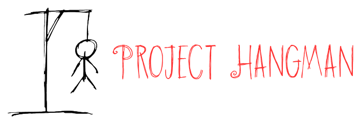

===============
*By Gabriel DUGNY and Vincent LACROUTS, Efrei Paris Promo 2022, November 2017.*

Introduction
------------
This program written in Python 3.6 allows the users to play the "Hangman" game, 
in a console or with a Tk graphical interface.

Presentation
------------
According to the sheet, the goal of the game is to guess a wordr, while your character on the screen is not
hung yet. 

The different algorithms
------------------------

Main difficulties encountered
-----------------------------

Analysis
--------

Conclusion
----------

